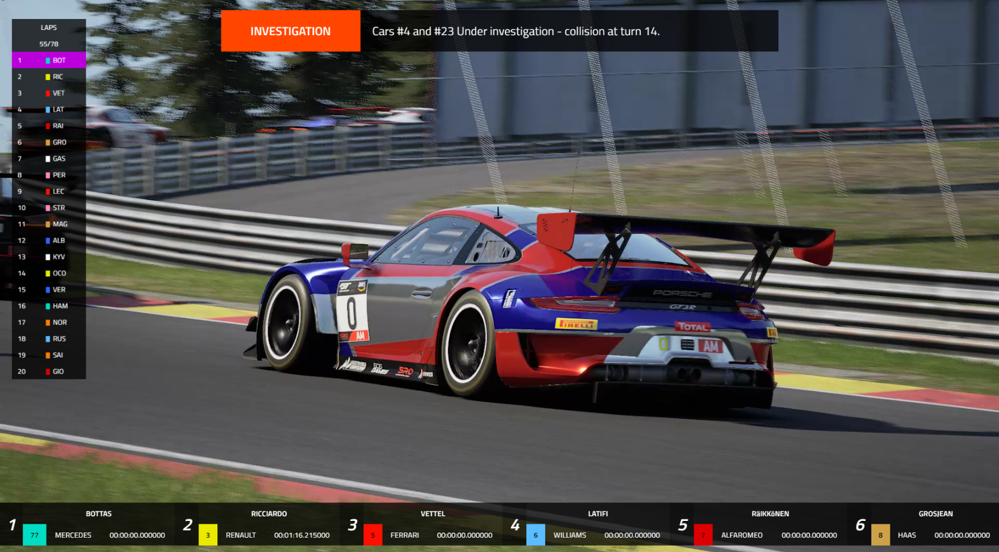

<!-- ABOUT THE PROJECT -->
## About The Project

# ⚠ PRE-RELEASE REPOSITORY ⚠

TimingTower (working-title) is a solution for racing/sim-racing productions to display leadboards and statistics, where it may be very difficult (or impossible) to get data from the event onto viewers' screens. Users can manually change grid orderings, fastest laps, flags etc whenever they like via the upcoming dashboard currently in development. If you just like how flexible TimingTower is, then you can simply write your own database-adapter that can send data from your game to the MySQL Server. TimingTower works out-of-the-box with your favourite streaming apps such as StreamLabsOBS and Xsplit - all you need to do is add it as a browser source and customise the sizing. Thanks to TT being a web-app, everything is dynamic, the wider you make the tower, the more data your viewers will see!

 

The app currently uses AJAX for fetching/updating the tower elements (laps, flags, positions, lap times etc) by calling PHP functions if there is data to be updated.

 

TimingTower is a work in progress, so all screenshots and builds in this repository will contain broken and confusing code - you have been warned!

### Built With

*  PHP - Main Backend Code e.g. SQL Connections, Authentication and Logging.
*  MySQL - Database for storing all data coming from the dashboard controller (or custom database-adapter)
*  MDBootstrap - CSS Framework, very simillar to regular bootstrap.
*  AJAX - Dynamically refreshes data in the tower when required.

Once I am happy with the state of TT, the 1.0.0 version will be published to a new repo, where post launch fixes can be pushed to - along with (hopefully) going Open-Source!

